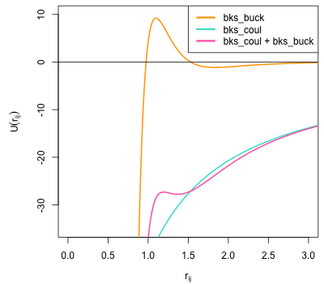
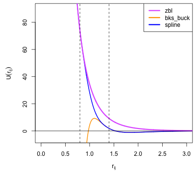

Pair Potential Tabulation 
==========================

Pair potentials are tabulated using ``PairTabulation`` objects, a tabulation class is provided for each target (note an alternative procedural interface is also provided :func:`atsim.potentials.writePotentials`\ ):

    * :class:`atsim.potentials.pair_tabulation.DLPoly_PairTabulation`
        * Class for creating DL_POLY ``TABLE`` files.
    * :class:`atsim.potentials.pair_tabulation.Excel_PairTabulation` 
        * Produces Excel spreadsheet files from :class:`atsim.potentials.Potential` objects. This is useful for plotting potentials and debugging purposes (also see :ref:`potable-troubleshooting`)\ .
    * :class:`atsim.potentials.pair_tabulation.GULP_PairTabulation`
        * Suitable for producing files usable with the GULP code.
    * :class:`atsim.potentials.pair_tabulation.LAMMPS_PairTabulation`
        * Produces files for use with LAMMPS `pair_style table <https://lammps.sandia.gov/doc/pair_table.html>`_\ .

Using ``Tabulation`` objects 
----------------------------

The constructor of ``PairTabulation`` classes have the following basic signature::

    PairTabulation(self, potentials, cutoff, nr)

Where:

    * ``potentials`` is a list of :meth:`Potential <potential_objects>` objects. 
        * ``Potential`` objects have :meth:`~PotentialInterface.energy` and :meth:`~PotentialInterface.force` methods called during tabulation to obtain potential-energy as a function of separation and its derivative respectively.
        * see :ref:`instantiate_potential_object` and :ref:`predefined_potential_forms`\ .
    * ``cutoff`` is a float giving the maximum separation represented by the tabulation.
    * ``nr`` the number of rows to be included in the tabulation.

Therefore to create a :class:`~atsim.potentials.pair_tabulation.LAMMPS_PairTabulation` with a 10 Å cutoff with 5000 rows from a list of potentials stored in the variable ``potentials`` the following would be used::

    tabulation = LAMMPS_PairTabulation(potentials, 10, 5000)

The pair potential model can then be written to a file-like object using the :meth:`~atsim.potentials.pair_tabulation.PairTabulation_AbstractBase.write` method::

    with open("tabulation.lmptab", "w") as outfile:
        tabulation.write(outfile)
            

.. seealso::

    * :ref:`python_api_quick_start` provides a complete example of using ``PairTabulation`` objects.

.. _potential_objects:

Potential Objects
-----------------

Potential objects should implement the following interface:

.. class:: PotentialInterface
    
    .. attribute:: speciesA

        (str): Attribute giving first species in pair being described by pair-potential

    .. attribute:: speciesB
        
        (str): Attribute giving second species in pair described by pair-potential

    .. method:: energy(self, r)

        Calculate energy between atoms for given separation.

        :param r: Separation between atoms of speciesA and speciesB
        :type r: float
        :return: Energy in eV for given separation.
        :rtype: float

    .. method:: force(self, r)

        Calculate force (-dU/dr) for interaction at a given separation.

        :param r: Separation
        :type r: float
        :return: -dU/dr at `r` in eV per Angstrom.
        :rtype: float
    	

In most cases the :class:`atsim.potentials.Potential` class provided in :mod:`atsim.potentials` can be used. This wraps a python callable that returns potential energy as a function of separation to provide the values returned by the :meth:`~atsim.potentials.Potential.energy` method. The forces calculated by the :meth:`~atsim.potentials.Potential.force` method are obtained by taking the numerical derivative of the wrapped function. 

.. _instantiate_potential_object:

Example: Instantiating :class:`atsim.potentials.Potential` Objects
^^^^^^^^^^^^^^^^^^^^^^^^^^^^^^^^^^^^^^^^^^^^^^^^^^^^^^^^^^^^^^^^^^

The following example shows how a Born-Mayer potential function can be described and used to create a Potential object for the interaction between Gd and O. The Born-Mayer potential is given by:

.. math::

    U_{\text{Gd-O}}(r_{ij}) = A \exp\left( \frac{- r_{ij}}{{\rho}} \right)

Where :math:`U_{\text{Gd-O}}(r_{ij})` is the potential energy between atoms :math:`i` and :math:`j` of types Gd and O,  separated by :math:`r_{ij}`. The parameters :math:`A` and :math:`\rho` will be taken as 1000.0 and 0.212.

The Gd-O potential function can be defined as:

.. code-block:: python

    import math
    from atsim.potentials import Potential

    def bornMayer_Gd_O(rij):
        energy = 1000.0 * math.exp(-rij/0.212)
        return energy

This is then passed to ``Potential``'s constructor along with the species names:

.. code-block:: python

    pot = Potential('Gd', 'O', bornMayer_Gd_O)

The energy and force at a separation of 1Å can then be obtained by calling the ``energy()`` and ``force()`` methods:

.. code-block:: python

    >>> pot.energy(1.0)
    8.942132960434881
    >>> pot.force(1.0)
    42.17987245936639

.. _predefined_potential_forms:

Predefined Potential Forms
--------------------------

In the `previous example <instantiate_potential_object>`_\ , a function named ``bornMayer_Gd_O()`` was defined for a single pair-interaction, with the potential parameters hard-coded within the function. Explicitly defining a function for each interaction quickly becomes tedious for anything but the smallest parameter sets. In order to make the creation of functions using standard potential forms easier, a set of function factories are provided within the ``atsim.potentials.potentialsforms`` module.

Using the ``potentialsforms`` module, the function:

    .. code:: python

        import math

        def bornMayer_Gd_O(rij):
            energy = 1000.0 * math.exp(-rij/0.212)
            return energy

can be rewritten as:

    .. code:: python

        from atsim.potentials import potentialforms
        bornMayer_Gd_O = potentialsforms.bornmayer(1000.0, 0.212)

See API reference for list of available potential forms: :ref:`atsim_potentials_potentialforms`

.. todo::

    Module documentation doesn't show list of potentialforms as module is populated at runtime.

.. _combining_potential_forms:

Combining Potential Forms
^^^^^^^^^^^^^^^^^^^^^^^^^

Pair interactions are often described using a combination of standard potential forms. This was seen for the Basak potentials used within the :ref:`python_api_quick_start` example, where the oxygen-uranium pair potential was the combination of a Buckingham and Morse potential forms. This combination was made using the :func:`~atsim.potentials.plus` function. This returns a callable which, when invoked, returns the sum of the values returned by the callables originally passed to :func:`~atsim.potentials.plus`\ . 

The combination functions listed below will return a wrapped function that correctly evaluate the first and second derivatives of the combined callables. That is, when the callables provide ``.deriv()`` and ``.deriv2()`` methods, these will, where possible be used in the evaluation. In this way accurate analytical derivatives can be combined and will appear in the resulting tabulation. If any callable does not implement these methods, the system will revert to using numerical evaluation of derivatives.

* Combination functions:
    * :func:`atsim.potentials.plus`
        * Sum the return values of constituent callables.
    * :func:`atsim.potentials.pow`
        * Takes two functions and returns a third which when evaluated returns the result of ``a(r)**b(r)``
    * :func:`atsim.potentials.product`
        * Takes two callables and returns a third which when evaluated returns the result of ``a(r) * b(r)``\ .

.. _spline_interpolation :

Spline Interpolation
--------------------

The :class:`.SplinePotential` class can be used to smoothly interpolate between two different potential forms within the same potential curve: one potential function acts below a given cutoff (referred to as the detachment point) and the other potential function takes over at larger separations (acting above a second cutoff called the attachment point). An exponential interpolating spline acts between the detachment and attachment points to provide a smooth transition between the two potential curves. 

.. seealso::

    * :ref:`Splining with potable <aspot-splining>` - description of how to do splining with potable rather than using the Python API.

The :class:`.SplinePotential` class aims to automatically determine spline coefficients such that the resultant, interpolated,  potential curve is continuous in its first and second derivatives. The analytical form of the interpolating spline is (where :math:`r_{ij}` is interatomic separation and :math:`B_{0..5}` are the spline coefficients calculated by the :class:`.SplinePotential` class):

.. math::
    
    U(r_{ij}) = \exp \left( B_0 + B_1 r_{ij} + B_2 r_{ij}^2 + B_3 r_{ij}^3 + B_4 r_{ij}^4 + B_5 r_{ij}^5 \right)

The :class:`.SplinePotential` has a number of applications, for example:

    *   certain potential forms can become attractive in an unphysical manner at small separations (an example is the so-called Buckingham catastrophe); :class:`.SplinePotential` can be used to combine an appropriate repulsive potential at short separations whilst still using the other form for equilibrium and larger separations.
    *   similarly different potential forms may be better able to express certain separations than others. For instance the :func:`~atsim.potentials.potentialforms.zbl` potential is often used to describe the high energy interactions found in radiation damage cascades but must be combined with another potential to describe equilibrium properties.

The :class:`atsim.potentials.spline.Buck4_SplinePotential` can also be used to connect two potential functions. The splined region of this potentialform is described via an instance of :class:`atsim.potentials.spline.Buck4_Spline`\ .

Both :class:`atsim.potentials.spline.Buck4_SplinePotential` and :class:`atsim.potentials.spline.SplinePotential` inherit from :class:`atsim.potentials.spline.Custom_SplinePotential`\ . This provides the useful property :attr:`~atsim.potentials.spline.Custom_SplinePotential.splineCoefficients` which can be used to access the coefficients used to describe the polynomial connecting the two potential functions. These are often quoted in journal papers as they allow the same spline to be reproduced exactly by readers.

.. _example_spline:

Example: Splining ZBL Potential on to Buckingham Potential
^^^^^^^^^^^^^^^^^^^^^^^^^^^^^^^^^^^^^^^^^^^^^^^^^^^^^^^^^^

As mentioned above, for certain parameterisations, popular potential forms can exhibit unphysical behaviour for some interatomic separations. 

.. seealso::

    * A version of this example which uses potable instead of the Python API is given here: :ref:`spline-exp_spline-example`\ .

A popular model for the description of silicate and phosphate systems is that due to van Beest, Kramer and van Santen (the BKS potential set) [#bks]_. In the current example, the Si-O interaction from this model will be considered. This uses the Buckingham potential form with the following parameters:
    
    * A = 18003.7572 eV
    * :math:`\rho` = 0.205204 Å
    * C = 133.5381 eV :math:`Å^6`
    * Charges:
        -   Si = 2.4 *e*
        -   O  = -1.2 *e*

The following plot shows the combined coulomb and short-range contributions for this interaction plotted as a function of separation. The large C term necessary to describe the equilibrium properties of silicates means that as :math:`r_{ij}` gets smaller, the :math:`\frac{C}{r_{ij}^6}` overwhelms the repulsive Born-Mayer component of the Buckingham potential meaning that it turns over. This creates only a relatively shallow minimum arround the equilibrium Si-O separation. Within simulations containing high velocities (e.g. high temperatures or collision cascades) atoms could easily enter the very negative, attractive portion of the potential at low :math:`r_{ij}` - effectively allowing atoms to collapse onto each other. In order to overcome this deficiency a ZBL potential will be splined onto the Si-O interaction within this example.

    Plot of BKS Si-O potential showing the short-range (bks_buck) component, electrostatic (bks_coul) and the effective Si-O interaction (bks_buck + bks_coul). This shows that this potential turns over at small separations making it unsuitable for use where high energies may be experienced such as high-temperature or radiation damage cascade simulations.

The first step to using :class:`.SplinePotential` is to choose appropriate detachment and attachment points. This is perhaps best done plotting the two potential functions to be splined. The :mod:`.potentials` module contains the convenience functions :func:`atsim.potentials.plot` and :func:`atsim.potentials.plotToFile` to make this task easier. The following piece of code first defines the ZBL and Buckingham potentials before plotting them into the files ``zbl.dat`` and ``bks_buck.dat``. These files each contain two, space delimited, columns giving :math:`r_{ij}` and energy, and may be easily plotted in Excel or GNU Plot. 

.. code-block:: python
    
    from atsim.potentials import potentialforms
    import atsim.potentials

    zbl = potentialforms.zbl(14, 8)
    bks_buck = potentialforms.buck(18003.7572, 1.0/4.87318, 133.5381)

    atsim.potentials.plot( 'bks_buck.dat', 0.1, 10.0, bks_buck, 5000)
    atsim.potentials.plot( 'zbl.dat', 0.1, 10.0, zbl, 5000)

Plotting these files show that ``detachmentX`` and ``attachmentX`` values of 0.8 and 1.4 may be appropriate. The ``zbl`` and ``bks_buck`` functions can then be splined between these points as follows:

.. code-block:: python
    
    spline = atsim.potentials.SplinePotential(zbl, bks_buck, 0.8, 1.4)
 

Plot data can then be created for the combined functions with the interpolating spline:

.. code-block:: python

    atsim.potentials.plot( 'spline.dat', 0.1, 10.0, spline, 5000)

Plotting the splined Si-O potential together with the original ``buck`` and ``zbl`` functions allows the smooth transition between the two functions to be observed, as shown in the following function:
    

    Plot of BKS Si-O interaction showing the short-range (buck) and ZBL functions plotted with the curve generated by ``SplinePotential`` (spline). This joins them with a an interpolating spline acting between the detachment point at :math:`r_{ij} = 0.8` and re-attachment point at :math:`r_{ij} = 1.4` shown by dashed lines. 

Finally, the potential can be tabulated in a format suitable for LAMMPS:

.. code-block:: python

    bks_SiO = atsim.potentials.Potential('Si', 'O', spline)
    tabulation = atsim.potentials.pair_tabulation.LAMMPS_PairTabulation(
        [bks_SiO],
        10.0, 5000)
    with open('bks_SiO.lmptab', 'w') as outfile:
        tabulation.write(outfile)

.. [#bks] Van Beest, B. W. H., Kramer, G. J., & van Santen, R. A. (1990). Force fields for silicas and aluminophosphates based on ab initio calculations.  *Physical Review Letters* , **64** (16), 1955–1958. http://dx.doi.org/doi:10.1103/PhysRevLett.64.1955
