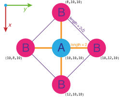

.. _potable-many-body-models:

Many body models
================

Models that use the Embedded Atom Method (EAM) can be tabulated using :ref:`potable <potable-tool>`. Embedded atom models take the general form

.. math::
  :label: eq_standard_eam

  E_i = F_\alpha \left( \sum_{j \neq i} \rho_\beta(r_{ij}) \right) + \frac{1}{2} \sum_{j \neq i} \phi_{\alpha \beta} (r_{ij})

* Where:

  * :math:`\rho_\beta(r_{ij})` is the density function which gives the electron density for atom :math:`j` with species :math:`\beta` as a function of its separation from atom :math:`i`, :math:`r_{ij}`.
  * The electron density for atom :math:`i` is obtained by summing over the density (:math:`\rho_\beta (r_{ij}`) contributions due to its neighbours.
  * The embedding function :math:`F_\alpha(\rho)` is used to calculate the many-bodied energy contribution from this summed electron density.
  * The sum :math:`\frac{1}{2} \sum_{j \neq i} \phi_{\alpha \beta} (r_{ij})` gives the pair-potential contribution to atom :math:`i`'s energy. 
  * :math:`\phi_{\alpha \beta} (r_{ij})` are simply pair potentials that describe the energy between two atoms as a function of their separation.

In order to support the description of EAM when compared to  :ref:`pair-potential models <potable-pair-potential-models>`, additional sections in the input file are required. These are:

  * ``[EAM-Density]``: defines EAM density functions.
  * ``[EAM-Embed]``: describe the model's embedding functions.

As before, the pairwise section of the forcefield is specified in the :ref:`[Pair] section <potable-pair-section>` of the input file.

The EAM sections of the input are defined in much the same way as the :ref:`[Pair] section <potable-pair-section>`\ . Both  ``[EAM-Density]``\ , ``[EAM-Embed]`` allow the use of :ref:`multi-range potential definitions <multi-range-potentials>` and :ref:`potential modifiers <potential-modifiers>`\ . 

As for pair  only models, many-bodied force fields can specify :ref:`[Potential-Form] <potable-potential-form>` and  :ref:`[Table-Form] <potable-table-form>` sections can be provided if custom functional forms are required in ``[EAM-Density]``\ , ``[EAM-Embed]`` or ``[Pair]``\ .

.. _many-body-models-eam-density:

``[EAM-Density]``
+++++++++++++++++

The density functions for embedded atom models are specified in this section. For the EAM form shown in equation :eq:`eq_standard_eam` entries in this section take the form::

    SPECIES : POTENTIAL_FORM PARAM_1 PARAM_2 ... PARAM_N

* Where:

  * ``SPECIES`` species for which density should be calculated
  * ``POTENTIAL_FORM PARAM_1 PARAM_2 ... PARAM_N`` potential form definition.

Density functions are tabulate in :math:`r_{ij}` space, therefore their extent and resolution are controlled by the the :ref:`dr <ref-potable-input-tabulation-dr>`\ , :ref:`nr <ref-potable-input-tabulation-nr>` and :ref:`cutoff <ref-potable-input-tabulation-cutoff>` fields in the :ref:`[Tabulation] <ref-potable-input-tabulation>` section in the same way as for ``[Pair]`` potentials.

.. note::

  The ``SPECIES`` label can take the form ``ALPHA->BETA`` for Finnis-Sinclair tabulations. See :ref:`Finnis Sinclair Models, below <finnis-sinclair-eam-models>` and :ref:`[EAM-Density] <ref-potable-eam-density>` in the reference section .

Example
-------

A density function for silver may look something like this::

  [EAM-Density]
  Ag : as.exponential 4681.013008649 -6

This is taken from :ref:`potable_sutton_ag_example`\ . As you can determine from the parameters given there, and just for fun, this could have been defined using potential-modifiers as this, which makes the original parameters self evident::

  [EAM-Density]
  Ag : pow(
           product(as.constant 4.09, 
                   pow(
                       as.polynomial 0 1, 
                       as.constant -1)), 
           as.constant 6)

.. _many-body-models-eam-embed:

``[EAM-Embed]``
+++++++++++++++

Embedding functions are defined in this section. 

Entries have the following form::

    SPECIES : POTENTIAL_FORM PARAM_1 PARAM_2 ... PARAM_N

Where:

    * ``SPECIES`` is atomic type at which the surrounding electron density will be embedded using the specified potential form.
    * ``POTENTIAL_FORM PARAM_1 ...`` \ : embedding functions instantiate potential forms in the same way as in the :ref:`[Pair] <ref-potable-input-pair>` section.

.. note::

    Embedding functions are tabulated using rho values. The resolution and extent of functions in rho are defined by ``drho``\ , ``nrho`` and ``cutoff_rho`` in the :ref:`[Tabulation] section <ref-potable-input-tabulation>`\ .

Example
-------

This shows the embedding function used in the :ref:`potable_sutton_ag_example` for Ag::

  [EAM-Embed]
  Ag : product(as.constant 2.5415e-3, as.sqrt -144.41)

Note the use of the :ref:`product() <modifier-product>` modifier to apply a constant multiplication factor to the square root embedding function.

Standard EAM Examples
+++++++++++++++++++++

.. toctree::
  :hidden:

  potable_sutton_ag

More complete examples of EAM tabulation are listed in the following table:

================================ =======================================================================================
Example                          Description
================================ =======================================================================================
:ref:`potable_sutton_ag_example` An example of how to tabulate a single component EAM potential for Ag, to use in LAMMPS
================================ =======================================================================================

.. _finnis-sinclair-eam-models:

Finnis-Sinclair Style EAM Models
++++++++++++++++++++++++++++++++

A variation of the standard EAM is supported allowing different density functions to be specified for each pair of species. Before looking at this let's have another look at original definition of the EAM given in :eq:`eq_standard_eam`\ :

.. math::

  E_i = F_\alpha \left( \sum_{j \neq i} \rho_\beta(r_{ij}) \right) + \frac{1}{2} \sum_{j \neq i} \phi_{\alpha \beta} (r_{ij})

Here the many body term is:

.. math::

  F_\alpha \left( \sum_{j \neq i} \rho_\beta(r_{ij}) \right)

From this it can be seen that for any atom type :math:`\beta` surrounding atom :math:`i`\ , the same density function is used for :math:`\beta`\ , no matter the species (:math:`\alpha`\ ) of the central atom. So in the standard EAM, the density due to a :math:`B` atom neighbouring an :math:`A` atom would be calculatd by :math:`\rho_B (r_{ij})`\ . Similarly a :math:`B` atom next to another :math:`B` atom  would also have its density calculated using the same :math:`\rho_B (r_{ij})` function.

By comparison, the EAM variant (referred to as Finnis-Sinclair by LAMMPS) has the following form:

.. math::
  :label: eq_finnis_sinclair_eam

  E_i = F_\alpha \left( \sum_{j \neq i} \rho_{\alpha\beta}(r_{ij}) \right) + \frac{1}{2} \sum_{j \neq i} \phi_{\alpha \beta} (r_{ij})

The difference is subtle, but has important implications for the expressiveness of the potential model. The density function now becomes :math:`\rho_{\alpha\beta}(r_{ij})` meaning it is now specific the types of the interacting species. So the density due to a :math:`B` atom around an :math:`A` atom would be given by :math:`\rho_{AB} (r_{ij})` whilst a different function :math:`\rho_{BB} (r_{ij})` would be used for :math:`B` atoms around :math:`A` atoms.

The :ref:`potable <potable-tool>` tool allows this concept to be expressed by using a slightly different style of  ``[EAM-Density]`` section. To define the two density functions described in the previous paragraph this would look like this::

  [EAM-Density]
  A->B : DENSITY_AB
  B->B : DENSITY_BB

Where:
  * ``DENSITY_AB`` and ``DENSITY_BB`` would be the two potential-forms for the 'B surrounding A' and 'B surrounding B' density functions.

Summarising, the ``[EAM-Density]`` section of Finnis-Sinclair style ``potable`` files has contains ``SPECIES`` labels of the form::

  ALPHA->BETA

Where:
  * ``ALPHA`` is the central atom species for the density function.
  * ``BETA`` is the surrrounding atom species for the density function.

Finnis-Sinclair style models can be used with the following tabulation targets:

  * ``excel_eam_fs``
  * ``DL_POLY_EAM_fs``
  * ``setfl_fs``

.. _many_body_models_potable_finnis_sinclair:

Example
-------

The following example aims to demonstrate the difference between the standard and Finnis-Sinclair potential models and how to tabulate them. For simplicity a 'toy' atomic configuration will be used, this is illustrated in :numref:`fig_finnis_sinclair_example` and can be downloaded as a LAMMPS file: :download:`toy_structure.lmpstruct <example_files/toy_structure.lmpstruct>` (``atom_style charge``).

  The atomic configuration used in this example (viewed down z-axis).

The coordination environments of the A and B atoms in this structure are as follows:

.. table:: Coordination environment of the different atoms.

  +--------------+-------------------+--------------------+
  | Central Atom | Surrounding Atoms | :math:`r_{ij}`     |
  +==============+===================+====================+
  | A            | 4 × B             | 2.0                |
  +--------------+-------------------+--------------------+
  | B            | 1 × A             | 2.0                |
  |              +-------------------+--------------------+
  |              | 1 × B             | 4.0                |
  |              +-------------------+--------------------+
  |              | 2 × B             | :math:`2 \sqrt{2}` |
  +--------------+-------------------+--------------------+

Standard EAM
^^^^^^^^^^^^

For our toy example, let's define the density due to an A atom as :math:`\rho_A(r_{ij}) = 2r_{ij}` and that due to B as :math:`\rho_B(r_{ij}) = 3r_{ij}`. Using these we can extend our table to calculate the density expected around each type of atom:

.. table:: Density calculation
  :name: table_eam_density_calculation

  +--------------+-------------------+--------------------+----------------------------------+-------------------------------------+---------------------+
  | Central Atom | Surrounding Atoms | :math:`r_{ij}`     | :math:`\rho_A(r_{ij}) = 2r_{ij}` | :math:`\rho_B(r_{ij}) = 3r_{ij}`    | Total :math:`\rho`  |
  +==============+===================+====================+==================================+=====================================+=====================+
  | A            | 4 × B             | 2.0                |                                  | 4 × 3 × 2.0 = 24.0                  | **24.0**            |
  +--------------+-------------------+--------------------+----------------------------------+-------------------------------------+---------------------+
  | B            | 1 × A             | 2.0                | 1 × 2 × 2.0 = 4.0                |                                     | 4.0 + 12.0 + 16.971 |
  |              +-------------------+--------------------+----------------------------------+-------------------------------------+ = **32.971**        |
  |              | 1 × B             | 4.0                |                                  | 1 × 3 × 4.0 = 12.0                  |                     |
  |              +-------------------+--------------------+----------------------------------+-------------------------------------+                     |
  |              | 2 × B             | :math:`2 \sqrt{2}` |                                  | 2 × 3 × :math:`2 \sqrt{2}` = 16.971 |                     |
  +--------------+-------------------+--------------------+----------------------------------+-------------------------------------+---------------------+

Looking at the calculation in :numref:`table_eam_density_calculation` we can see that the density around an **A** atom is **24.0** and that around **B** is **32.971**.

Let's confirm that this is the case by running a LAMMPS calculation that reproduces the hand calculation given in the table using the following ``potable`` input (:download:`standard_eam.aspot <example_files/standard_eam.aspot>`)

.. literalinclude:: example_files/standard_eam.aspot
  :language: none

**Notes:**

  * The ``[Species]`` section has been included so we can use **A** and **B** as species labels rather than proper element names.
  * The ``[Pair]`` section has been left empty as we haven't defined any pair potentials to use with this model.

The ``[EAM-Density]`` section uses the :ref:`as.polynomial <potform-polynomial>` potential form to give our :math:`\rho_A(r_{ij}) = 2r_{ij}` and :math:`\rho_B(r_{ij}) = 3r_{ij}` density functions::

  [EAM-Density]
  A = as.polynomial 0 2
  B = as.polynomial 0 3

More unusual is the use of the :ref:`as.polynomial <potform-polynomial>` and :ref:`as.zero <potform-zero>` potential forms in the ``[EAM-Embed]`` section. Our example is in no way trying to reproduce the physics of atomic bonding but is instead showing how the EAM and its tabulations works. As a result the ``[EAM-Embed]`` section looks like this::

  [EAM-Embed]
  A = as.polynomial 0 1
  B = as.zero

Here the embedding function for **A** has been set to :ref:`as.polynomial 0 1 <potform-polynomial>`. This is useful for debugging as this is an identity function meaning that the 'energy' calculated by LAMMPS for each **A** atom will instead be its summed density.

The embedding function for **B** has been set to :ref:`as.zero <potform-zero>` meaning the density around these atoms will not contribute to the value output by LAMMPS. We will turn the **B** embedding function back on later in the example, however for our first run the ``potable`` tabulation should result in the density surrounding the single **A** atom in :numref:`fig_finnis_sinclair_example` being produced. According to the calculation in :numref:`table_eam_density_calculation` this should be **24.0**\ .

Run potable on :download:`standard_eam.aspot <example_files/standard_eam.aspot>` to produce a table file named ``standard_eam.eam``\ ::

  potable standard_eam.aspot standard_eam.eam

Now download the structure file (:download:`toy_structure.lmpstruct <example_files/toy_structure.lmpstruct>`\ ) and the following LAMMPS input script (:download:`standard_evaluate.lmpin <example_files/standard_evaluate.lmpin>`\ ) into the same directory as your table:

.. literalinclude:: example_files/standard_evaluate.lmpin

Now let's run this through LAMMPS to evaluate our table file for the example structure::

  lammps -in standard_evaluate.lmpin  -log standard_evaluate.lmpout

This should produce output similar to this:

.. literalinclude:: example_files/standard_evaluate.lmpout

As you can see from the penultimate line we obtain our expected value of 24.0 for the density of the **A** atom::

  ENERGY:24.000000000000014211

Now change the ``[EAM-Embed]`` section as follows, to turn off the **A** density and turn on the **B** density::

  [EAM-Embed]
  A = as.zero
  B = as.polynomial 0 1

Running the same process as above we get the following ``ENERGY`` line in our output::

  ENERGY:131.88225099390862738

Remembering that we have four **B** atoms in our system, each with an expected density of 32.971 then it can be seen that this equates well to what we would expect: 4×32.971 = 131.884.

Finnis-Sinclair
^^^^^^^^^^^^^^^

We will now extend this example to use different density functions for the AB and BA interactions. The following functions will be used:

* :math:`\rho_{AB} (r_{ij}) = 3 r_{ij}`
* :math:`\rho_{BB} (r_{ij}) = 5 r_{ij}`
* :math:`\rho_{BA} (r_{ij}) = 2 r_{ij}` 

Using these functions will produce a density around the **A** atom that is the same as in the standard EAM example above. This is because the :math:`\rho_{AB} (r_{ij})` function is the same as the :math:`\rho_{A} (r_{ij})` used earlier. However, the function for calculating the B density surrounding a B atom is now different from the earlier example (:math:`\rho_{BB} (r_{ij}) = 5 r_{ij}`). As the :math:`\rho_{BA} (r_{ij})` function also matches the equivalent :math:`\rho_{A}` function from earlier, it is only the change introduced by the new :math:`\rho_{BB} (r_{ij}) = 5 r_{ij}` function for B-B pairs, that will change the LAMMPS output for this example. Due to the single A atom there are no density contribution from A-A pairs in this system. 

The density calculation for the Finnis-Sinclair model can now be performed by hand as shown in :numref:`table_eam_density_calculation_finnis_sinclair`\ .

.. table:: Density calculation
  :name: table_eam_density_calculation_finnis_sinclair

  +--------------+-------------------+--------------------+----------------------------------------+-------------------------------------+----------------------------------------+---------------------+
  | Central Atom | Surrounding Atoms | :math:`r_{ij}`     | :math:`\rho_{AB}(r_{ij}) = 3r_{ij}`    | :math:`\rho_{BA}(r_{ij}) = 2r_{ij}` | :math:`\rho_{BB}(r_{ij}) = 5r_{ij}`    | Total :math:`\rho`  |
  +==============+===================+====================+========================================+=====================================+========================================+=====================+
  | A            | 4 × B             | 2.0                | 4 × 3 × 2.0 = 24.0                     |                                     |                                        | **24.0**            |
  +--------------+-------------------+--------------------+----------------------------------------+-------------------------------------+----------------------------------------+---------------------+
  | B            | 1 × A             | 2.0                |                                        | 1 × 2 × 2.0 = 4.0                   |                                        | 4.0 + 20.0 + 28.284 |
  |              +-------------------+--------------------+----------------------------------------+-------------------------------------+----------------------------------------+ = **52.284**        |
  |              | 1 × B             | 4.0                |                                        |                                     | 1 × 5 × 4.0 = 20.0                     |                     |
  |              +-------------------+--------------------+----------------------------------------+-------------------------------------+----------------------------------------+                     |
  |              | 2 × B             | :math:`2 \sqrt{2}` |                                        |                                     | 2 × 5 × :math:`2 \sqrt{2}` = 28.284    |                     |
  +--------------+-------------------+--------------------+----------------------------------------+-------------------------------------+----------------------------------------+---------------------+

This can be described in the ``potable`` format as follows (:download:`finnis_sinclair_eam.aspot <example_files/finnis_sinclair_eam.aspot>`):

.. literalinclude:: example_files/finnis_sinclair_eam.aspot
  :language: none

Note that the ``[Tabulation]`` section now specifies a Finnis-Sinclair compatible tabulation target::

  [Tabulation]
  target : setfl_fs

The important differences between this file and the standard EAM example can be found in the ``[EAM-Density]``\ ::

  [EAM-Density]
  A->B = as.polynomial 0 3
  B->A = as.polynomial 0 2
  B->B = as.polynomial 0 5

The first entry in this section defines the :math:`\rho_{AB}(r_{ij}) = 3r_{ij}` function and it should be apparent how the remaining density functions are specified. 

Tabulate the :download:`finnis_sinclair_eam.aspot <example_files/finnis_sinclair_eam.aspot>` file::

  potable finnis_sinclair_eam.aspot finnis_sinclair.eam.fs

Copy the :download:`toy_structure.lmpstruct <example_files/toy_structure.lmpstruct>` structure file and the following LAMMPs input file (:download:`finnis_sinclair_evaluate.lmpin <example_files/finnis_sinclair_evaluate.lmpin>`) to the same directory as your tabulation:

.. literalinclude:: example_files/finnis_sinclair_evaluate.lmpin
  :language: none

Running LAMMPS to obtain the total **B** density::

  lammps -in finnis_sinclair_evaluate.lmpin -log finnis_sinclair_evaluate.lmpout

gives the following output::

  ENERGY:209.13708498984715334

Referring back to :numref:`table_eam_density_calculation_finnis_sinclair` and remmbering that there are four **B** atoms in the system the value expected from the hand calculation was 52.284 × 4 = 209.136. This very closely matches the value obtained from LAMMPS.